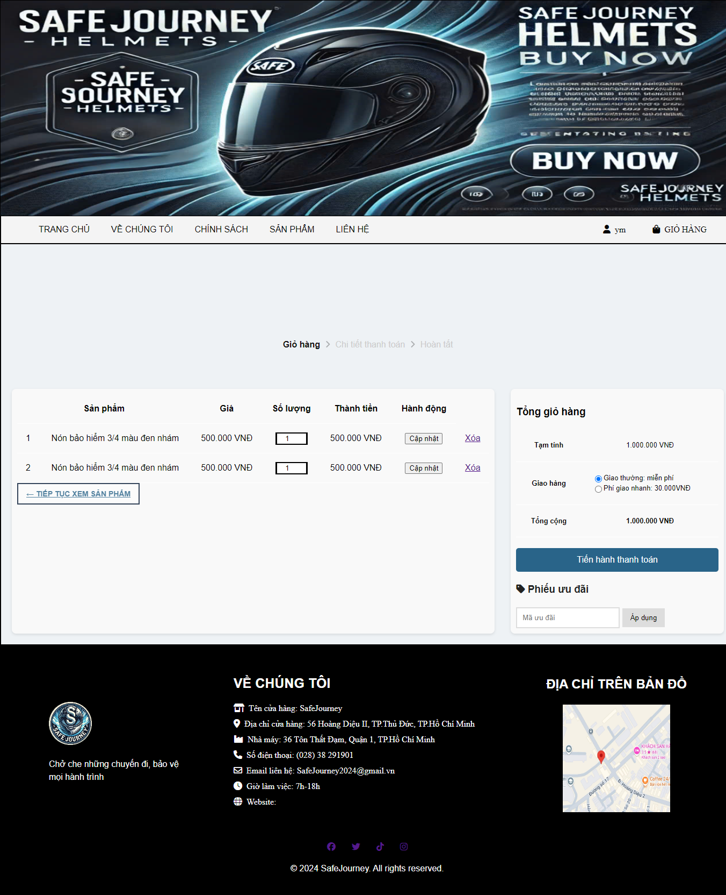
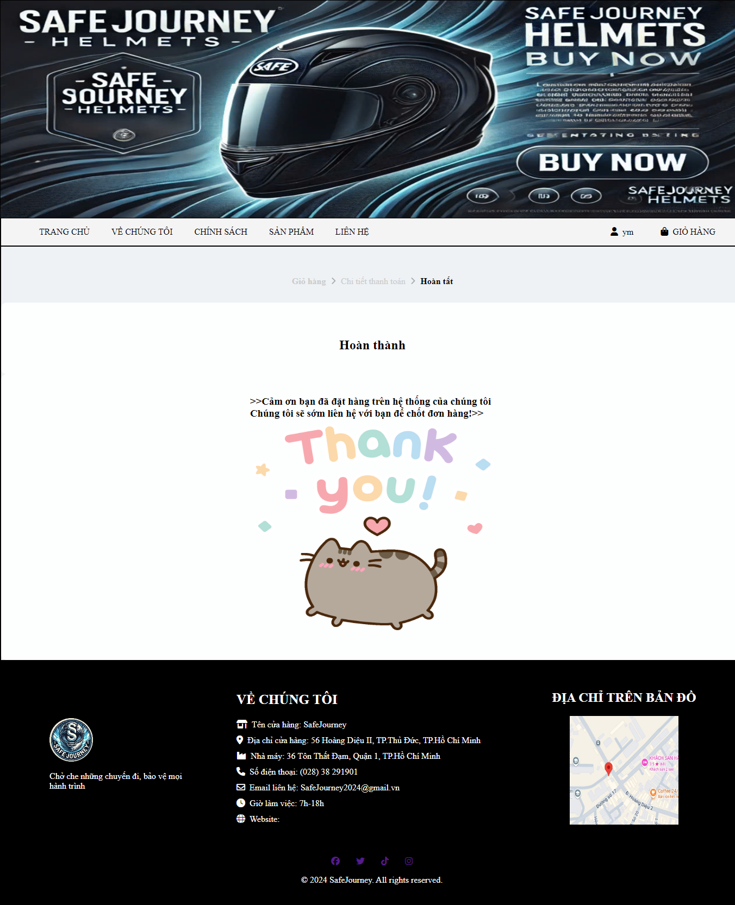

# PHẦN 2: TỔNG QUAN VỀ GITHUB

## Giới thiệu về GitHub

### Định nghĩa GitHub và một số khái niệm

GitHub là một nền tảng đám mây hỗ trợ phát triển phần mềm và quản lý phiên bản mã nguồn dựa trên Git. Nền tảng này cho phép các nhà phát triển lưu trữ, quản lý và chia sẻ mã nguồn, đồng thời hợp tác với những người khác trên toàn cầu. GitHub cung cấp nhiều công cụ hữu ích như quản lý phiên bản, yêu cầu kéo (pull requests), và quản lý vấn đề (issues), giúp tối ưu hóa quy trình phát triển phần mềm.

- Một số khái niệm liên quan đến GitHub:

\+ Git: là hệ thống quản lý phiên bản phân tán (Distributed Version Control System) giúp theo dõi và quản lý sự thay đổi mã nguồn của dự án. Nó lưu lại toàn bộ lịch sử phát triển của dự án, cho phép khôi phục và làm việc với nhiều phiên bản mã nguồn khác nhau.

**\+** Repository: Một kho lưu trữ là một thư mục chứa tất cả các tệp của một dự án.

\+ Branch: Một nhánh là một bản sao của một repository, cho phép bạn thực hiện các thay đổi mà không ảnh hưởng đến phiên bản chính.

\+ Commit: Một commit là một bản ghi của các thay đổi được thực hiện đối với mã nguồn.

\+ Pull request**:** Một yêu cầu kéo là một cách để đề xuất các thay đổi cho một repository.

### Lịch sử và sự phát triển của GitHub

Lịch sử của GitHub thể hiện sự phát triển nhanh chóng và sự tôn trọng của cộng đồng phát triển mã nguồn mở. Đóng góp của GitHub đã giúp định hình cách chúng ta làm việc và hợp tác trong lĩnh vực công nghệ thông tin và phát triển phần mềm.

**2008**: GitHub được thành lập bởi Tom Preston-Werner, Chris Wanstrath và PJ Hyett, ra mắt tại sự kiện TechCrunch Disrupt.

**2009**: GitHub trở thành nền tảng phổ biến cho các dự án mã nguồn mở lớn như Ruby on Rails và Node.js.

**2010**: GitHub nhận 7,5 triệu USD đầu tư từ Sequoia Capital, thúc đẩy sự phát triển nhanh chóng.

**2011**: GitHub đạt mốc hơn 1 triệu kho lưu trữ.

**2012**: Ra mắt dịch vụ GitHub Enterprise cho doanh nghiệp.

**2018**: Microsoft mua lại GitHub với giá 7,5 tỷ USD.

**2020**: GitHub ra mắt GitHub Codespaces, cho phép lập trình từ trình duyệt mà không cần cài đặt môi trường trên máy tính cá nhân.

## Tìm hiểu về GitHub
### Các tính năng chính của GitHub

GitHub, một trong những nền tảng quản lý dự án và phiên bản mã nguồn mở hàng đầu, có nhiều tính năng nổi bật. Những tính năng này làm cho Github trở thành một nền tảng mạnh mẽ cho phát triển phần mềm và quản lý dự án.

**Hệ Thống Quản Lý Phiên Bản (VCS):** Git-Hub sử dụng Git làm hệ thống quản lý phiên bản, cho phép theo dõi sự thay đổi trong mã nguồn và quản lý các version khác nhau của project.

**Repository:** GitHub cung cấp mô hình repository để lưu trữ mã nguồn. Mỗi dự án có thể có một repository riêng, và người dùng có thể sao chép (fork) repository của người khác để đóng góp vào dự án đó.

**Pull Requests:** Cho phép những người đóng góp đề xuất thay đổi vào repository gốc. Pull requests tạo ra một không gian cho thảo luận, xem xét mã nguồn và các sự điều chỉnh trước khi thay đổi được hợp nhất (merged) vào repository chính.

**Branching**: Git-Hub hỗ trợ việc tạo ra các nhánh (branches) khác nhau của dự án, cho phép phát triển đồng thời nhiều tính năng mà không ảnh hưởng đến nhau.

**Commit History**: Cho phép xem chi tiết lịch sử các commit, bao gồm thông tin về người thực hiện, thời gian và nội dung thay đổi.

**Issues**: Được sử dụng để theo dõi công việc, nhiệm vụ, lỗi, và các cải tiến. Mỗi vấn đề có thể được đặt nhãn, gán cho người thực hiện và được theo dõi qua thời gian.

**Projects:** GitHub Projects giúp quản lý công việc, theo dõi tiến độ và tổ chức công việc theo cách linh hoạt.

**Wiki và Pages**: Cho phép tạo ra trang Wiki để chia sẻ thông tin và tài liệu. Git-Hub Pages cung cấp khả năng tạo web tĩnh từ repository.

**Collaboration**: GitHub cung cấp các tính năng như nhận xét, thảo luận và cấp quyền truy cập để hỗ trợ sự hợp tác giữa các thành viên trong dự án.

**Integrations**: Hỗ trợ nhiều tích hợp với các công cụ phát triển phổ biến như **CI/CD (Continuous Integration/Continuous Deployment)**, linter, và các dịch vụ thử nghiệm tự động.

**Security Features**: Git-Hub cung cấp các công cụ để kiểm tra mã nguồn mở, quét lỗ hổng bảo mật, và theo dõi các phần mềm có thể bị ảnh hưởng.

**Community**: GitHub tạo ra một cộng đồng lớn với hàng triệu người phát triển trên khắp thế giới, cung cấp cơ hội cho việc học hỏi, chia sẻ và đóng góp.

### 2.2.2. Lợi ích và nhược điểm khi sử dụng GitHub

**Lợi ích của github:**

- Quản lý phiên bản mạnh mẽ nhờ sử dụng Git
- GitHub cung cấp nhiều công cụ giúp làm việc nhóm hiệu quả như branching, pull request, và code review
- Là nền tảng lớn nhất cho các dự án mã nguồn mở, giúp các lập trình viên dễ dàng công tác, nhận đóng góp và xây dưng phần mềm
- Tính năng tự động hóa giúp tiết kiệm thời gian và đảm bảo chất lượng
- Người dùng có thể tạo trang tĩnh để giới thiệu dự án, cung cấp tài liệu mà không cần có nền tảng chuyên sâu.
- Cung cấp các tính năng bảo mật mạnh mẽ giúp phát hiện và xử lý lỗ hổng trong mã nguồn hiệu quả và an toàn
- Cộng đồng lớn và mạng xã hội phát triển
- GitHub hỗ trợ tích hợp nhiều công cụ phát triển phần mềm giúp tối ưu quy trình làm việc
- Hệ thống Issues giúp theo dõi lỗi, yêu cầu tính năng hoặc nhiệm vụ một cách rõ ràng và dễ quản lý.

**Nhược điểm của GitHub:**

- Phụ thuộc nhiều vào Git
- Với người mới bắt đầu khá khó sử dụng, cần thời gian để làm quen
- Hiệu suất chậm với các dự án lớn hoặc quá nhiều tệp

# PHẦN 3: THIẾT KẾ VÀ TRIỂN KHAI QUẢN LÝ WEBSITE TRÊN GITHUB

## 3.1. Thiết kế hệ thống website

### 3.1.1. Đặc tả đề tài

**Mục Tiêu Dự Án:**

- Xây dựng một trang web thương mại điện tử: Tạo ra một nền tảng trực tuyến để bán nón bảo hiểm, cung cấp trải nghiệm người dùng mượt mà và dễ dàng truy cập thông tin sản phẩm.
- Tích hợp GitHub trong quy trình phát triển: Sử dụng GitHub để quản lý mã nguồn dự án, theo dõi thay đổi, và hợp tác hiệu quả giữa các thành viên trong nhóm phát triển.
- Đảm bảo quản lý mã nguồn hiệu quả: Thiết lập quy trình sử dụng Git để dễ dàng quản lý phiên bản, sửa lỗi và phát triển các tính năng mới cho website.
# PHẦN 4: ĐÁNH GIÁ KẾT QUẢ

## 4.1. Kết quả đạt được

Tìm hiểu công cụ Github trong việc quản lý cầu hình phần mềm, mà ở đây là quản lý phiên bản (version).

Hoàn thành việc lập trình và thiết kế đơn giản một website với giao diện trang chủ, trang đăng kí, đăng nhập, trang danh mục sản phẩm, trang chi tiết sản phẩm, trang giỏ hàng, trang thanh toán sản phẩm và các chức năng cơ bản.

Bên cạnh đó, việc học cách tư duy sáng tạo và giải quyết vấn đề là một kỹ năng quan trọng. Điều này cho phép đưa ra các giải pháp sáng tạo và hiệu quả để giải quyết các thách thức trong việc xây dựng website và rất hữu ích cho chúng em tiếp tục phát triển website phức tạp hơn trong tương lai.

Việc áp dụng kiến thức đã học để giải quyết các vấn đề thực tế là mục tiêu cuối cùng. Khi chúng em có khả năng sử dụng các kỹ năng và kiến thức đã học để tạo ra các giải pháp thực tế, chúng em có thể tạo ra giá trị và đóng góp trong các dự án và môi trường làm việc.

## 4.2. Hạn chế

Github là một công cụ để quản lý phiên bản - là một công cụ hữu ích trong việc quản lý mã nguồn, nhưng không thay thế được các công cụ và quy trình khác trong quản lý cấu hình phần mềm toàn diện.

Quy trình phát triển phần mềm trong thực tế được thực hiện dưới sự tham gia của nh iều người với những vai trò khác nhau và quản lý cấu hình phần mềm cũng vậy. Do điều kiện chưa được tiếp xúc nhiều với môi trường phát triển phần mềm thực tế nên không thể làm rõ hết được vai trò quyền hạn của từng người trong quá trình thực hiện quản lý.

Quá trình phân tích và thiết kế chưa hoàn thiện, cần phải bổ sung thêm chức năng để đáp ứng tốt hơn với nhu cầu người sử dụng. Đặc biệt là GitHub chỉ chạy web tĩnh, không hỗ trợ chạy web động gây khó khăn trong việc chạy trên internet.

## 4.3. Hướng phát triển

Ứng dụng Github để đưa vào quản lý phiên bản phần mềm cho những môn học khác cũng như những dự án mà mình tham gia.

Tìm hiểu những công cụ đi kèm, hỗ trợ khác trong quá trình phát triển phần mềm đề góp phần tạo ra sản phẩm đạt chất lượng cao nhất, tối ưu hóa các chức năng để người dùng có thể dễ dàng sử dụng hơn.

Tìm hiểu, thực tập tại các môi trường phát triển phần mềm thực tế để làm rõ quy trình, vai trò, nhiệm vụ của từng thành viên trong dự án.

Nâng cao các tính năng như mở rộng danh mục sản phẩm để nâng cao sản phẩm có sẵn trên trang web và đa dạng sản phẩm có cộng tác để cải thiện các công cụ hỗ trợ quản lý dự án như GitHub Projects, tăng cường khả năng theo dõi tiến độ và tổ chức công việc nhóm.

Cải tiến GitHub Pages: Thêm các tính năng tối ưu hóa việc triển khai website tĩnh, giúp người dùng không cần phụ thuộc vào các dịch vụ hosting khác.

Hỗ trợ AI/ML tốt hơn: GitHub có thể phát triển thêm các công cụ tự động hoá cho quá trình phát triển mã nguồn bằng AI, như GitHub Copilot, giúp nâng cao năng suất lập trình.

MỘT SỐ HÌNH ẢNH TRANG WEB

